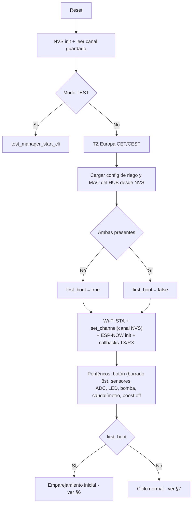
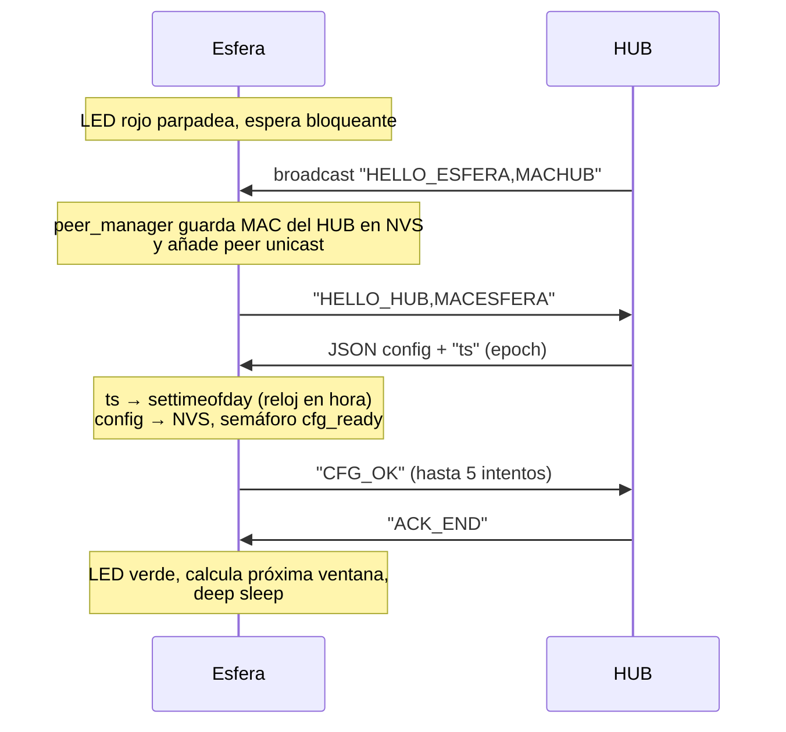
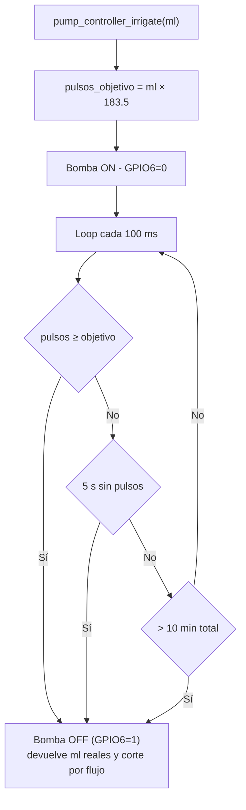

# Firmware Esfera — `solar-irrigator-slave`

> Documento parte de una serie de 4:
> HUB (`solar-irrigator-hub/ARQUITECTURA.md`) · **Esfera (este)** · App Android (`smartgrowapp/ARQUITECTURA.md`) · Visión de sistema (`SISTEMA-SMARTGROW.md`)

## 1. Qué es

La esfera es el nodo de riego autónomo del sistema. Corre en un **ESP32-C3** alimentado a batería (con carga solar), y su vida es un ciclo: **despertar → medir → regar si toca → reportar al HUB → dormir**. No tiene Wi-Fi a internet ni MQTT: su único interlocutor es el HUB, por **ESP-NOW**.

Todo el diseño está subordinado al consumo: entre ciclos entra en **deep sleep** (máximo 1 h por siesta), apaga Wi-Fi y el boost de la bomba, y solo enciende la radio lo imprescindible.

## 2. Hardware

| Recurso | GPIO | Uso |
|---|---|---|
| Botón | GPIO 0 | Pull-up. Mantener 8 s al arrancar ⇒ borrado NVS + reinicio. También despierta del deep sleep |
| Caudalímetro | GPIO 1 | Entrada con interrupción (flanco de bajada). ~183.5 pulsos/ml |
| Boost (alimentación bomba) | GPIO 2 | Salida. Se apaga antes de dormir |
| Batería (VBAT) | GPIO 3 / ADC1_CH3 | Divisor 100k/(100k+68k), calibración curve-fitting |
| Estado del cargador | GPIO 4 | Entrada |
| Bomba | GPIO 6 | Salida **activo-bajo** (0 = ON) |
| LED RGB WS2812B | GPIO 7 | Vía RMT (animaciones de estado) |
| Alimentación externa presente | GPIO 10 | Entrada (detecta acople al HUB) |
| Sensor AHT20 (temp/hum) | GPIO 20/21 | I2C, con verificación CRC y rangos de coherencia |

## 3. Mapa de módulos

| Componente | Responsabilidad |
|---|---|
| `main/solar_irrigator_slave.c` | Máquina de estados del ciclo completo (primer arranque vs ciclo normal), gestión de canal Wi-Fi, envío de telemetría, deep sleep |
| `peer_manager` | Protocolo con el HUB: handshake HELLO, parseo/persistencia de configuración, sincronización de reloj vía `ts`, handshake CFG_OK/ACK_END |
| `pump_controller` | Riego por volumen: bomba + conteo de pulsos del caudalímetro, timeouts de seguridad |
| `sensor_manager` | AHT20 por I2C (CRC, reintentos, validación de coherencia) |
| `power_manager` | Lectura de batería por ADC calibrado; GPIOs de cargador/alimentación |
| `led_manager` | WS2812B por RMT: color directo y animaciones |
| `time_sync` | Cálculo de la próxima ventana de despertar según máscara de días; fijar reloj con epoch del HUB |
| `button_manager` | Borrado de fábrica por botón al arrancar |
| `test_manager` | Modo TEST con CLI (activable por Kconfig o ventana de arranque), persiste el modo en NVS |

## 4. Ciclo de vida completo

```mermaid
stateDiagram-v2
    [*] --> Boot
    Boot --> ModoTest: NVS work_mode == TEST
    ModoTest --> ModoTest: CLI (no retorna)

    Boot --> PrimerArranque: sin MAC de HUB o sin config en NVS
    Boot --> CicloNormal: HUB y config presentes

    state PrimerArranque {
        [*] --> EsperaHello: LED rojo parpadeando
        EsperaHello --> RotarCanal: timeout 2 s sin HELLO
        RotarCanal --> [*]: guarda canal siguiente (1→2→...→13→1) y reinicia
        EsperaHello --> EsperaConfig: HELLO_ESFERA recibido → responde HELLO_HUB
        EsperaConfig --> Handshake: JSON de config + ts recibido y guardado
        Handshake --> Dormir1: CFG_OK ↔ ACK_END, LED verde
    }

    state CicloNormal {
        [*] --> Medir: leer AHT20 + mediana de 5 VBAT
        Medir --> Regar: hoy activo y hora en ventana de +180 s
        Medir --> Enviar: no toca regar
        Medir --> Enviar: batería bloqueada; no regar
        Regar --> Enviar
        Enviar --> Barrer: 3 ciclos sin entrega
        Barrer --> EsperarConfig: prueba canales 1..13 sin reiniciar
        Enviar --> EsperarConfig: telemetría v2 (3 intentos)
        EsperarConfig --> CalcularSleep: config+ts recibidos (o timeout 2.5 s)
    }

    Dormir1 --> [*]
    CalcularSleep --> DeepSleep: máx 1 h por siesta
    DeepSleep --> Boot: timer o botón
```

## 5. Arranque y gestión de canal

El canal Wi-Fi/ESP-NOW se guarda en NVS (`storage/wifi_chan`, por defecto 1). En el primer emparejamiento, si en **2 segundos** no llega el `HELLO_ESFERA` del HUB, la esfera avanza al canal siguiente (1 → 2 → … → 13 → 1), lo persiste y **se reinicia** para aplicar el cambio limpio. Así converge al canal que el router haya impuesto al HUB. Durante la búsqueda, el LED rojo parpadea; recorrer los 13 canales, incluyendo la espera y los reinicios, puede tardar aproximadamente 40 segundos en el peor caso.

## 6. Primer emparejamiento (visto desde la esfera)

Si el semáforo se libera pero la config en NVS no es válida, la esfera muestra el LED rojo con ciclo 250 ms encendido / 750 ms apagado durante 30 s y después duerme 20 s. En cada despertar vuelve a comprobar el acople y se recupera automáticamente cuando el HUB entrega una configuración válida.

## 7. Ciclo normal (despertar programado)

Orden real del código (los "STATE n" de los logs):

1. **Medir**: AHT20 y mediana de 5 lecturas VBAT válidas por ADC. Los errores ADC (`-1.0`) se descartan; si fallan las cinco se usa `vbat=0.00` y no se bloquea el riego. Si falla el AHT20 se usan `hum=0.0,temp=0.0`, pero la telemetría se envía siempre.
2. **Verificar riego**: con config de NVS y reloj válido (epoch ≥ 2023), riega si *hoy* está activo en la máscara y la hora actual está dentro de `[hora_objetivo, hora_objetivo+180 s]`. El riego es **bloqueante** (ver §8). VBAT <3,35 V bloquea la bomba hasta que VBAT >3,45 V; VBAT <3,55 V solo marca aviso. La histéresis vive en RTC memory.
3. **Enviar telemetría v2**: payload CSV exacto `hum,temp,vbat,riego,ml,st MACESFERA`, sin terminador nulo, con confirmación del callback TX y **3 intentos**. `ml` son los mililitros medidos por el caudalímetro y `st` es el mapa de estado (AHT20, corte por flujo, batería, omisión de riego y hora válida).
   Tras 3 ciclos sin entrega, la esfera prueba los 13 canales en el mismo despertar, sin reiniciar, y persiste el canal que responde. Tras 5 barridos completos fallidos pasa a barrer una vez cada 6 despertares.
4. **Esperar respuesta** (≤2.5 s): el HUB siempre contesta reenviando la configuración con `ts` fresco ⇒ la esfera se re-sincroniza el reloj y adopta cambios de configuración **en cada ciclo**.
5. **Handshake de ACK** si había config nueva pendiente (CFG_OK ↔ ACK_END).
6. **Dormir**: `time_sync_get_next_wakeup_from_mask` calcula el tiempo hasta la próxima hora de riego activa, con **tope de 1 h** — para ventanas lejanas la esfera duerme en siestas de 1 h encadenadas. Sin config ⇒ fallback 1 h. Antes de dormir: `esp_now_deinit`, `esp_wifi_stop`, boost off, retención de GPIOs, wakeup por timer y por botón.

## 8. Riego por volumen (`pump_controller`)

Las dos salidas de seguridad protegen contra depósito vacío / manguera pinzada (timeout de flujo 5 s) y contra un caudalímetro que cuenta de menos (timeout absoluto 10 min). `pump_controller_irrigate()` devuelve los ml medidos, saturados a 65535, y señala por separado el corte por falta de caudal. `pump_controller_stop()` permite corte manual (usado por el modo test).

## 9. Protocolo con el HUB (`peer_manager`)

Cualquier recepción ESP-NOW pasa por `peer_manager_on_data_recv`:

| Payload | Acción |
|---|---|
| `ACK_END` | Libera el semáforo del handshake CFG_OK |
| `HELLO_ESFERA...` | Responde `HELLO_HUB,<MAC propia>` (emparejamiento) |
| JSON `{...}` | 1) `ts` → fija reloj. 2) Parsea `diasRiego` + `horaRiego` + `ml`, guarda en NVS, marca ACK pendiente y libera `cfg_ready_sem` |
| Otro texto | Se ignora con warning |

Además, **cualquier** mensaje recibido actualiza la MAC del HUB guardada si cambió — la esfera se re-empareja sola si se la acopla a otro HUB.

Tolerancia de formatos (importante para compatibilidad app/hub):

- `diasRiego`: string de 7 dígitos `"1010000"` (L..D, bit 6 = lunes) **o** número (`100` ⇒ `"0000100"`).
- `horaRiego`: `"HH:MM"`, `"HHMM"` o número `HHMM`.
- `ml`: número 0–65535.
- `colorLED` y `riegoAuto` llegan en el JSON pero **hoy no se parsean ni se usan**.

## 10. Persistencia (NVS, namespace `storage`)

| Clave | Contenido |
|---|---|
| `wifi_chan` | Canal Wi-Fi actual (rotación 1→2→…→13→1) |
| `hub_mac` | MAC del HUB emparejado (blob 6 bytes) |
| `cfg_hr` / `cfg_min` / `cfg_days` / `cfg_ml` | Configuración de riego |
| `cfg_src` | MAC de quien envió la config (informativo) |
| `cfg_valid` | 1 = configuración completa y válida |
| (test_manager) | Modo de trabajo STANDARD/TEST |

## 11. Detalles finos y pendientes

- **El reloj depende del HUB**: no hay RTC ni SNTP; tras un reset la hora es inválida hasta que llega un JSON con `ts`. `time_sync_is_valid()` (epoch ≥ 2023) protege de regar con hora basura, pero un ciclo sin contacto con el HUB tampoco riega. `time_sync_request_time()` es un stub que solo lee el reloj local.
- **Ventana de riego de 180 s**: si la esfera despierta >3 min tarde (deriva del RTC en deep sleep, siestas encadenadas), el riego de ese día se pierde. La app lo detecta como alerta de "riego fallido".
- **Semántica de `riego`**: vale 1 cuando se intentó regar, incluso si el caudal fue insuficiente. `ml` contiene lo realmente entregado y `st.bit1` distingue el corte por falta de caudal.
- **Deriva del deep sleep**: dormir en tramos de ≤1 h con re-sincronización en cada contacto con el HUB es la mitigación elegida contra la deriva del oscilador.
- Si el envío y su eventual barrido fallan, la lectura de ese ciclo **se pierde** (no hay buffer local de pendientes en la esfera; el buffer persistente vive en el HUB). Los contadores de recuperación sí sobreviven al deep sleep en RTC memory.
- `sleep_mode_active` es un flag global que permite desactivar el deep sleep (útil en pruebas).
